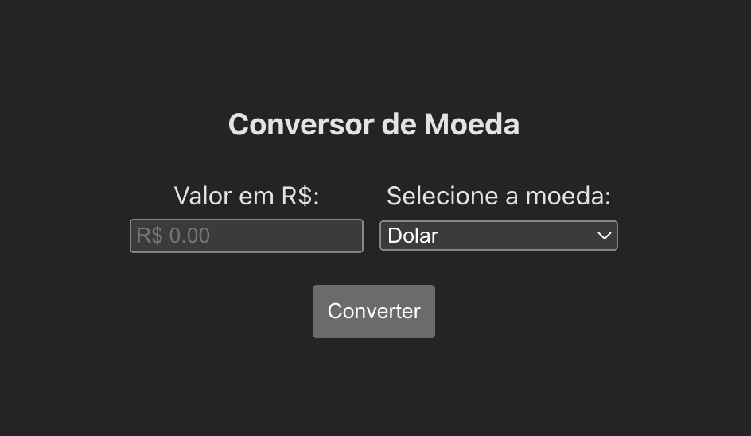
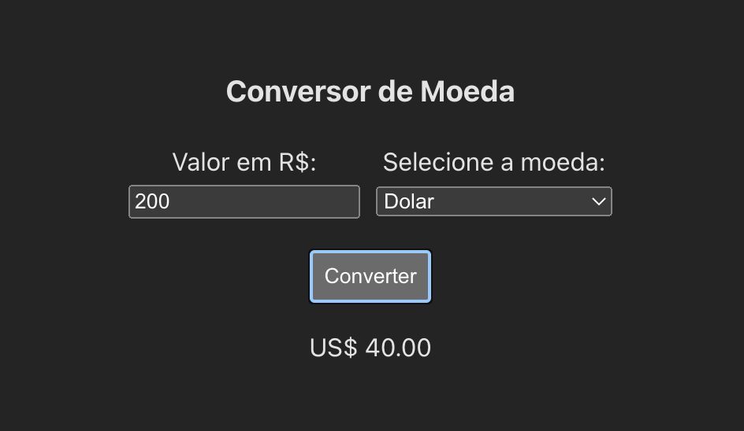

# (Conversor de Moeda) Currency Converter

## Table of contents

- [Overview](#overview)
  - [The challenge](#the-challenge)
  - [Screenshots](#screenshots)
  - [Links](#links)
- [My process](#my-process)
  - [Built with](#built-with)
  - [What I learned](#what-i-learned)
  - [Continued development](#continued-development)
  - [Useful resources](#useful-resources)
- [Author](#author)

## Overview

### The challenge

First App with React.JS

Users should be able to:

- Select the currency option to convert Brazilian Currency for what was user select.
- See the result display under the button 'Converter'

### Screenshots





### Links

- Solution URL: [GithHub Repository](https://github.com/danielrsouza10/currency-converte)
- Live Site URL: [Currency Converter](https://danielrsouza10.github.io/currency-converte/)

## My process

### Built with

- React.JS
- Semantic HTML5 markup
- CSS custom properties
- Flexbox
- Javascript

### What I learned

How to create React Apps.
Inicial steps working with React. Learn what are components and why I should make use of them.
Learn how the files iteract with each other.

```jsx
function Converter(props) {
  const [inputValue, setInputValue] = useState("");
  const [userOption, setUserOption] = useState("Dolar");
  let [result, setResult] = useState("");

  function buttonHandler() {
    if (userOption === "Dolar") {
      setResult("US$ " + (inputValue * 0.2).toFixed(2));
    } else if (userOption === "Euro") {
      setResult("€ " + (inputValue * 0.18).toFixed(2));
    } else if (userOption === "Libra"){
      setResult("£ " + (inputValue * 0.16).toFixed(2));
    } else{
      setResult('$ ' + (inputValue * 47.25).toFixed(2));
    }
  }

  function inputHandler(e) {
    setResult("");
    setInputValue(e.target.value);
  }

  function optionHandler(e) {
    setResult("");
    setUserOption(e.target.value);
  }

  return (
    <>
      <div className={classes.input}>
      <Input onInputChange={inputHandler} />
        <div>
          <label htmlFor="moedas">Selecione a moeda:</label>
          <select name="moedas" id="moedas" onChange={optionHandler}>
            <option value="Dolar">Dolar</option>
            <option value="Euro">Euro</option>
            <option value="Libra">Libra</option>
            <option value="Peso">Peso Argentino</option>
          </select>
        </div>
      </div>
      <div>
        
        <Button onButtonClick={buttonHandler} />
        
      </div>
      <p>{result}</p>
    </>
  );
}

export default Converter;
```

### Continued development

I need more research about React and improve my skills.

### Useful resources

- [The Odin Project](https://www.theodinproject.com) - This helped me for React Components.

## Author

- Website - [Linkedin](https://www.linkedin.com/in/danielrsouza/)
- Instagram - [@danielrsouza](https://www.instagram.com/danielrsouza)

